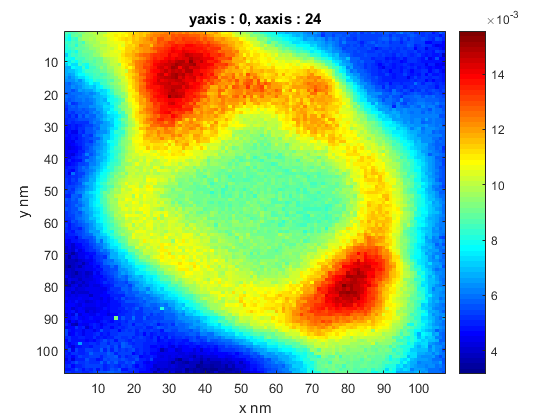

Hi,

Here 'mapping' is a Matlab code that I wrote to fit single spectrum to multiple gaussians in order to map 3D spectral
imaging consisting of spectrum at each pixel to 2D image through replacing spectrum with corresponding any
selected gaussian area.

This figures illustrates how we can split main spectrum into multiple Gaussian peaks. This code asks you the location of peaks manually and you can determine also how many Gaussian peaks you want to produce. Black line demonstrates the fitted line based on produced Gaussian peaks to check how it fits to original spectrum data.

For example, this figure is the mapping of Gaussian peak having amplitude at 24eV, which calculated by applying this decomposition algorithm pixel by pixel for our 3D spectral image and then by taking the area under corresponding Gaussian peak at each pixel. Finally, algorithm puts the value it found at that particular pixel. Note that this type of data consists of spectrum at each pixel, so at each pixel we can decomposte its spectrum and take the area of any desired Gaussian peak signal for each pixel and replace spectrum with that particular area value. As a result, we end up with 2D image. 

'normZLP' is a function that 'mapping' uses, which is important if you have actual EELS data and you want to center the 
zero-loss peak, normalize it and apply baseline correction to the result. It can also be used alone.

This code was written as a part of data processing of EELS (Electron Energy Loss Spectroscopy) mapping purposes. 

Please feel free to contact me for any improvement, questions or anything. Thank you.
