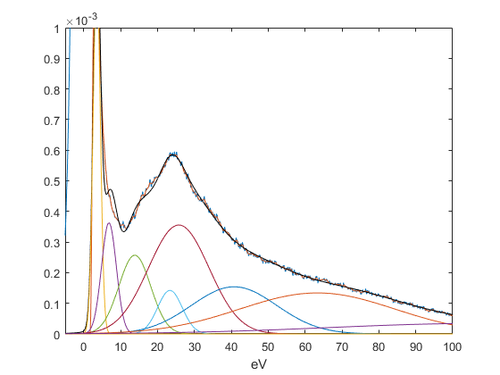

Hi,

Here 'mapping' is a Matlab code that I wrote to fit single spectrum to multiple gaussians in order to map 3D spectral
imaging consisting of spectrum at each pixel to 2D image through replacing spectrum with corresponding any
selected gaussian area.

This figures illustrates how we can split main spectrum into multiple Gaussian peaks. This code asks you the location of peaks manually and you can determine also how many Gaussian peaks you want to produce. 

'normZLP' is a function that 'mapping' uses, which is important if you have actual EELS data and you want to center the 
zero-loss peak, normalize it and apply baseline correction to the result. It can also be used alone.

This code was written as a part of data processing of EELS (Electron Energy Loss Spectroscopy) mapping purposes. 

Please feel free to contact me for any improvement, questions or anything. Thank you.
